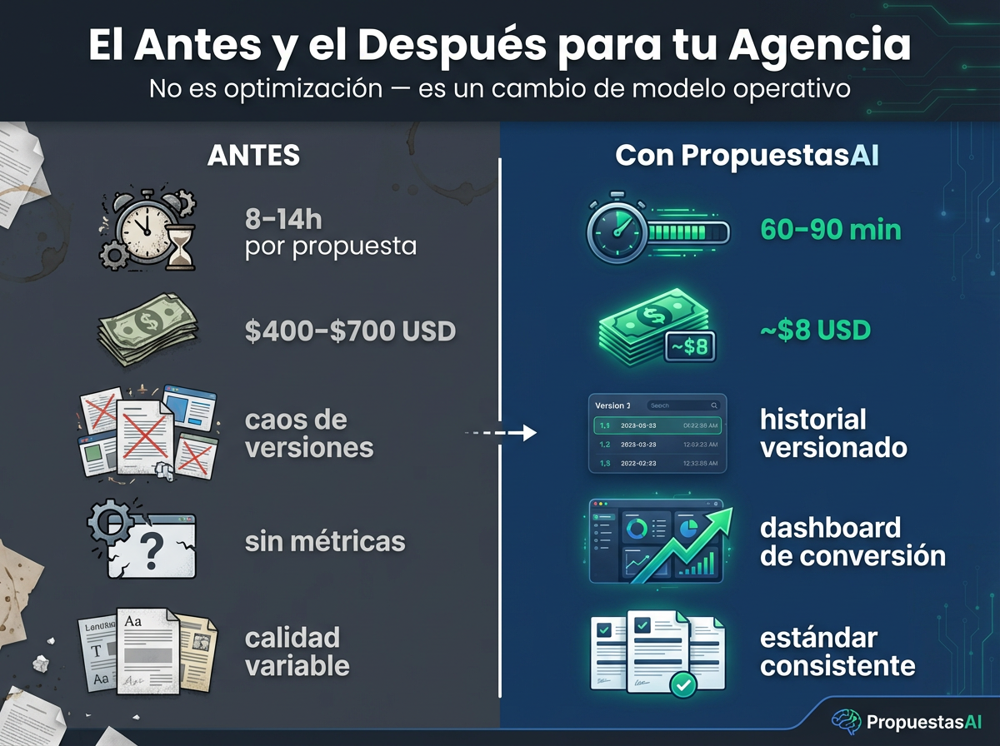
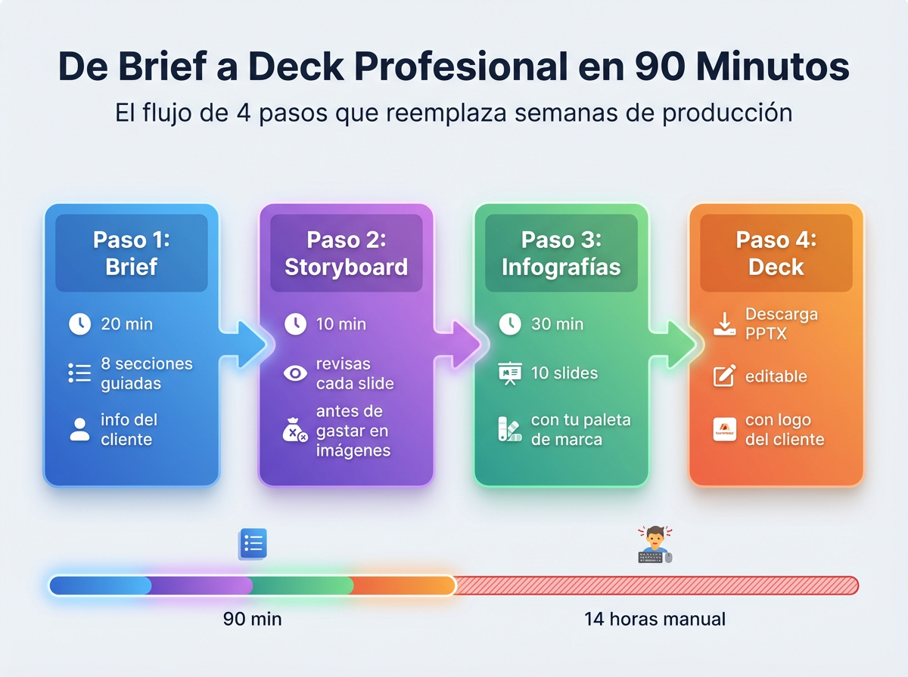
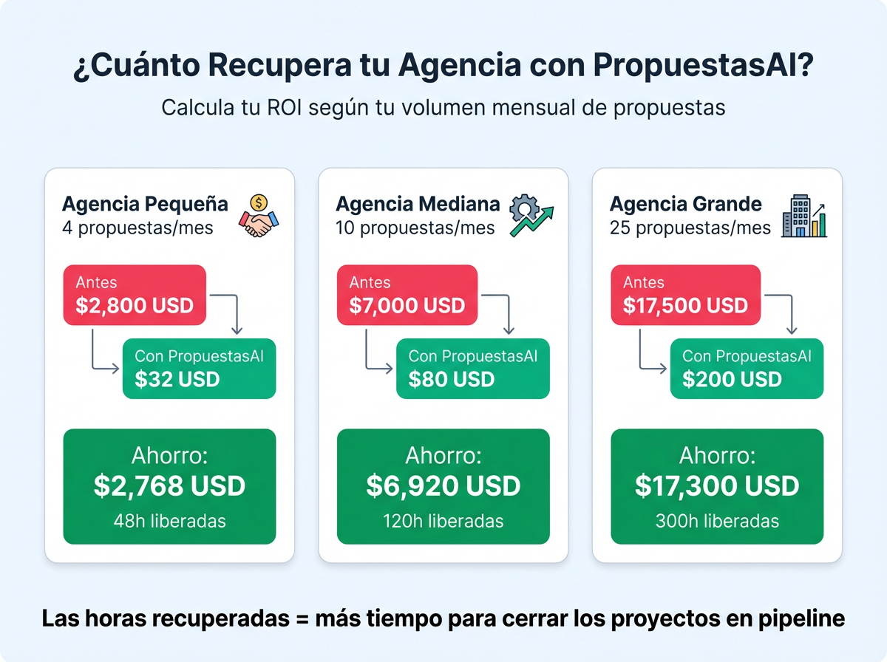
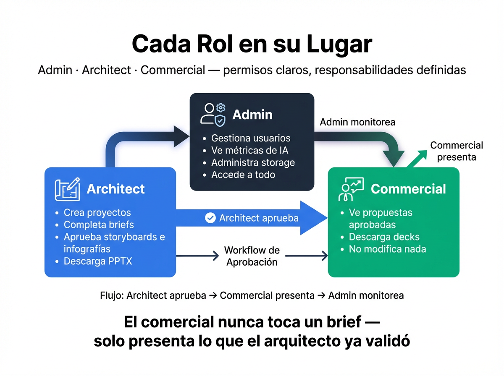
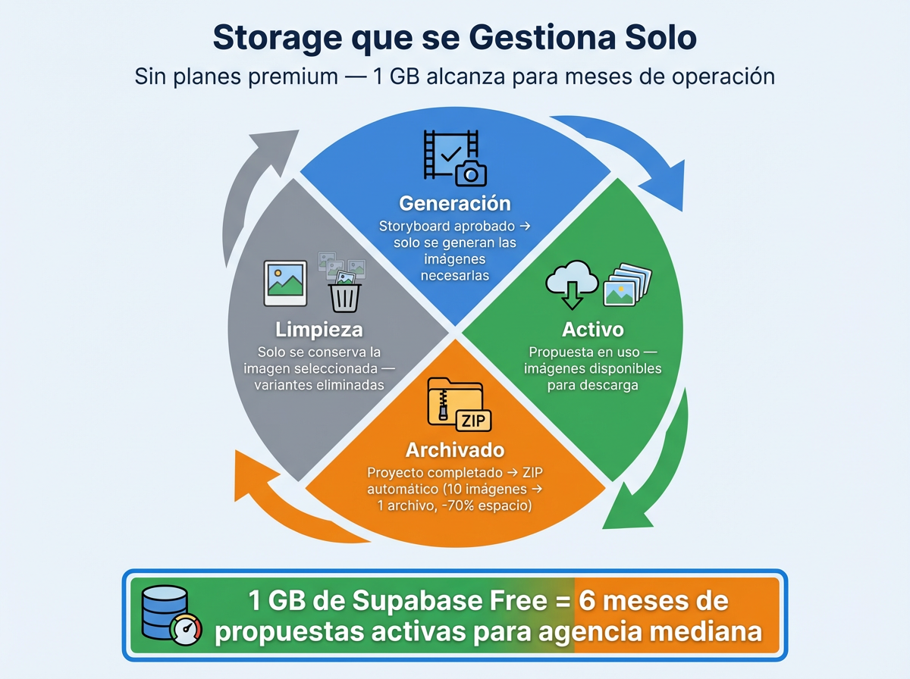
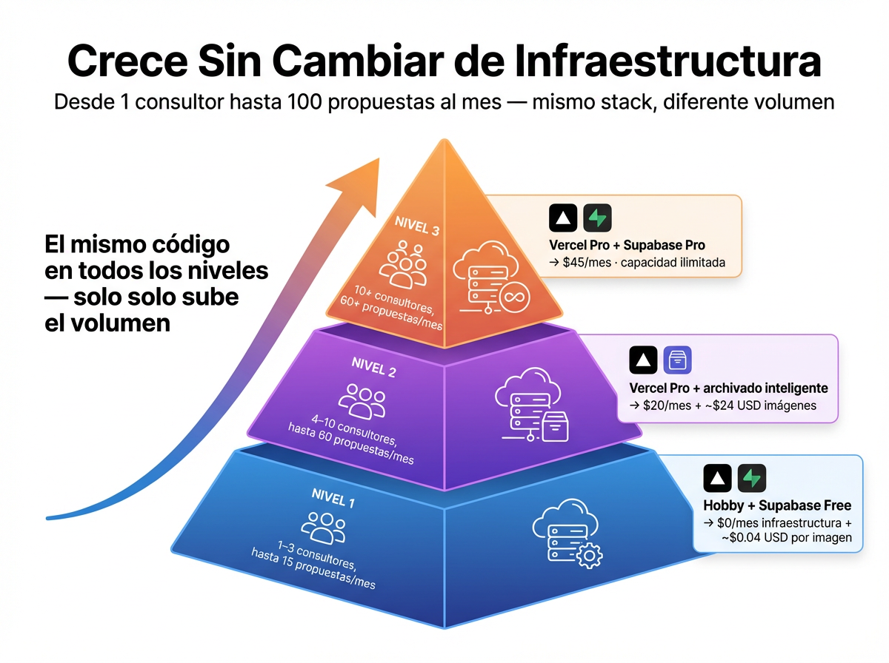

# PropuestasAI

> **De brief a deck profesional en 90 minutos.**
> El sistema que convierte el discovery de tu equipo en propuestas visuales listas para el cliente — sin diseñadores, sin PowerPoint, sin semanas de espera.

---

## ¿Por qué existe esto?

Cada propuesta técnica o comercial consume entre **14 y 18 horas-hombre** de tu equipo. Arquitecto, diseñador, gestor comercial — todos bloqueados produciendo material que el cliente hojea 30 segundos y archiva.

**PropuestasAI cambia el modelo operativo de tu agencia:**

<br>

<p align="center">
  
</p>

<br>

| | Antes | Con PropuestasAI |
|---|---|---|
| Tiempo por propuesta | 8–14 horas | **60–90 minutos** |
| Costo por propuesta | $400–$700 USD | **~$8 USD** |
| Control de versiones | Caos de archivos | Historial versionado |
| Métricas de calidad | Ninguna | Dashboard integrado |
| Consistencia visual | Variable | Estándar de marca |

<br>

### El flujo completo en 4 pasos

<p align="center">
  
</p>

<br>

### La propuesta que posiciona a tu agencia

Las propuestas con visualizaciones tienen **3× más probabilidad de ser recordadas** y compartidas internamente por el cliente.

<p align="center">
  
</p>

<br>

### ROI real según tu volumen mensual

<p align="center">
  
</p>

<br>

### Para quién es

| Rol | Lo que hace en la plataforma |
|-----|------------------------------|
| **Architect** | Crea proyectos, configura la identidad de marca, captura el discovery en el brief, revisa y aprueba el storyboard, genera infografías y descarga el PPTX |
| **Commercial** | Accede cuando la fase técnica está completa, revisa propuestas aprobadas y descarga los materiales |
| **Admin** | Acceso total + métricas de IA + gestión de usuarios + monitor de storage |

> **Premisa clave:** PropuestasAI no genera el discovery — lo captura. El arquitecto ya hizo las reuniones y el análisis. La plataforma toma esa información elaborada y produce los materiales visuales.

---

## Features

### Gestión de Proyectos

- **CRUD completo** de proyectos con estados: Activo, Completado, Archivado
- **Dashboard** con vista separada de proyectos archivados
- **Badge de estado** por proyecto — visual inmediato del progreso del pipeline
- **Acceso cerrado**: no hay registro público; solo Admin puede crear cuentas

<br>

### Identidad de Marca

- **Editor de brand identity** por proyecto: colores primario/secundario, tipografía, tagline y descripción visual en Markdown
- **Upload de logo** con validación de dimensiones (PNG/JPG, mín. 200×200 px)
- **Upload de fondo de slides** con validación de dimensiones (PNG/JPG, mín. 1920×1080 px)
- **Compositing automático del logo** en la esquina inferior derecha de cada slide generado — vía `sharp`, sin instrucciones al modelo de IA
- El fondo de marca se envía como referencia visual al modelo de imagen para mantener coherencia cromática

<br>

### Brief del Proyecto

- **Captura libre en Markdown** con 8 secciones guiadas: contexto, problema, solución, alcance, presupuesto, metodología, equipo y entregables
- Guardado en BD — versionado por proyecto
- Sirve como fuente de verdad para la generación del storyboard

<br>

### Storyboard con IA — Checkpoint Editorial

<p align="center">
  
</p>

- La IA genera el guión completo (título, datos, visualización, mensaje por slide) a partir del brief
- **Revisión y edición por sección** antes de generar una sola imagen — cero desperdicio de tokens
- Flujo de aprobación por slide: solo los slides aprobados disparan la generación
- Edición iterativa: el arquitecto ajusta, la IA regenera ese slide en específico
- Historial de cambios por sección

<br>

### Generación de Infografías

- **10 slides PNG generados de forma asíncrona** con progreso en tiempo real vía Supabase Realtime
- **Toggle de calidad por proyecto** que persiste en BD:
  - ⚡ **Flash** — `gemini-2.5-flash-image` — rápido, económico
  - ✦ **Pro** — `gemini-3.1-flash-image-preview` — mayor calidad visual
  - ✺ **Flux** — `flux.2-pro` — máxima calidad fotorrealista
- **Lightbox fullscreen** para revisar cada slide en detalle
- **Regeneración individual** con comentario de ajuste — solo ese slide, no toda la propuesta
- Borrado automático del archivo anterior en storage al regenerar (sin archivos huérfanos)
- **Descarga PPTX directa** desde la vista de infografías — marca el proyecto como Completado

<br>

### Capa de IA Unificada

Todo pasa por un único cliente en `src/lib/ai-client.ts` vía **OpenRouter**:

| Uso | Función | Modelo por defecto |
|-----|---------|-------------------|
| Imágenes Flash | `generateImage({ quality: 'flash' })` | `google/gemini-2.5-flash-image` |
| Imágenes Pro | `generateImage({ quality: 'pro' })` | `google/gemini-3.1-flash-image-preview` |
| Imágenes Flux | `generateImage({ quality: 'flux' })` | `black-forest-labs/flux.2-pro` |
| Texto (storyboards) | `generateText()` | `anthropic/claude-sonnet-4-6` |

- Modelos configurables en `.env.local` — sin tocar código al actualizar versiones
- **Widget de créditos por proyecto**: tokens consumidos, costo estimado USD y contadores por tipo de generación
- **Bitácora completa** en `ai_usage_logs`: proveedor, modelo, tarea, tokens, latencia, `is_revision`
- `is_revision: true` cuando el usuario pidió cambios — mide calidad efectiva del modelo

<br>

### Roles y Control de Acceso

<p align="center">
  
</p>

- **3 roles**: `architect`, `commercial`, `admin`
- Acceso cerrado: cuentas creadas exclusivamente por Admin desde `/admin/users`
- Cuentas creadas confirmadas — el usuario puede iniciar sesión de inmediato
- **Forzar cambio de contraseña** en el primer login de usuarios creados por admin
- Header global con email del usuario, badge de rol y navegación contextual
- Admin no puede eliminarse a sí mismo; usuarios `admin` no tienen botón de eliminar

<br>

### Dashboard Admin — Métricas de IA

- **Balance OpenRouter en tiempo real**: créditos comprados / usados / restantes
- **Rating de modelos por tasa de revisión** (menor = mejor calidad): identifica qué modelo necesita menos iteraciones
- **Logs completos de generación** con filtros por proyecto, modelo y fecha
- Badge de usuario por proyecto: quién está trabajando qué

<br>

### Storage Gestionado Automáticamente

<p align="center">
  
</p>

- **Ciclo de vida automático**: Generación → Activo → Archivado → Limpieza
- Dashboard `/admin/storage` con tamaño real en bucket por proyecto
- Monitor con barra de progreso del plan y alerta al 80% de uso
- Top 5 proyectos por consumo de storage
- Auto-archivado: proyectos completados >30 días → ZIP (brief + infografías) + limpieza del bucket
- Limpieza permanente de archivados >90 días (solo admin, con confirmación inline)

<br>

### Escalabilidad sin Cambiar de Infraestructura

<p align="center">
  
</p>

El mismo código en todos los niveles — solo sube el volumen:

| Plan Supabase | Storage | Precio | Propuestas activas (~9 MB c/u) |
|---------------|---------|--------|-------------------------------|
| Free | 1 GB | $0 | ~110 propuestas |
| Pro | 100 GB | $25/mes | ~11,000 propuestas |

---

## Setup y Puesta en Marcha

### Prerequisitos

| Herramienta | Versión | Para qué |
|-------------|---------|----------|
| Node.js | ≥ 18.x | Runtime |
| npm | ≥ 9.x | Package manager |
| Cuenta [Supabase](https://supabase.com) | — | BD, Auth, Storage, Realtime |
| Cuenta [OpenRouter](https://openrouter.ai) | — | Todos los modelos de IA |

### Instalación

```bash
# 1. Clonar el repositorio
git clone https://github.com/tu-org/propuestas-ai.git
cd propuestas-ai

# 2. Instalar dependencias
npm install

# 3. Copiar y configurar variables de entorno
cp .env.example .env.local
# → editar .env.local con tus credenciales (ver sección siguiente)

# 4. Configurar la base de datos
# → seguir SUPABASE_SETUP.md

# 5. Iniciar servidor de desarrollo
npm run dev
# Disponible en http://localhost:3000
```

### Variables de Entorno

```bash
# ─── Supabase ──────────────────────────────────────────────────────────
NEXT_PUBLIC_SUPABASE_URL=https://tu-proyecto.supabase.co
NEXT_PUBLIC_SUPABASE_ANON_KEY=eyJ...

# ─── OpenRouter (proveedor único de IA) ────────────────────────────────
OPENROUTER_API_KEY=sk-or-...

# ─── Modelos de imagen (cambiar aquí sin tocar código) ─────────────────
IMAGE_MODEL_FLASH=google/gemini-2.5-flash-image
IMAGE_MODEL_PRO=google/gemini-3.1-flash-image-preview
IMAGE_MODEL_FLUX=black-forest-labs/flux.2-pro

# ─── Modelo de texto para storyboards ──────────────────────────────────
TEXT_MODEL=anthropic/claude-sonnet-4-6

# ─── Configuración del sitio ───────────────────────────────────────────
NEXT_PUBLIC_SITE_URL=http://localhost:3000

# ─── Secreto para llamadas server-to-server ────────────────────────────
INTERNAL_API_SECRET=tu-secreto-seguro
```

> **Nota sobre Gemini:** `GEMINI_API_KEY` **no es necesario**. La generación de imágenes con Gemini directo requiere billing habilitado en Google Cloud (el free tier tiene quota = 0). Todo va por OpenRouter.

### Configuración de Base de Datos

Seguir la guía completa en [`SUPABASE_SETUP.md`](./SUPABASE_SETUP.md):

1. Crear proyecto en [supabase.com](https://supabase.com)
2. Ejecutar el schema SQL incluido en el repo
3. Configurar Storage bucket `project-assets`
4. Habilitar Google OAuth (opcional)
5. Crear el usuario admin inicial

**Credenciales del admin inicial (solo desarrollo):**
```
Email:    test@propuestasai.com
Password: Test1234!
```

> Para promover un usuario a `admin`: Supabase Dashboard → Table Editor → `profiles` → columna `role`.

### Gestión de Usuarios

PropuestasAI usa **acceso cerrado** — no hay registro público.

1. Iniciar sesión con cuenta admin
2. Ir a **Usuarios** (botón en el header superior derecho)
3. Ingresar email y contraseña del nuevo usuario → **+ Crear usuario**
4. La cuenta se crea confirmada — el usuario puede iniciar sesión de inmediato

### Deploy en Vercel

```bash
vercel
```

Variables requeridas en el dashboard de Vercel:

```
NEXT_PUBLIC_SUPABASE_URL      NEXT_PUBLIC_SUPABASE_ANON_KEY
OPENROUTER_API_KEY            IMAGE_MODEL_FLASH
IMAGE_MODEL_PRO               IMAGE_MODEL_FLUX
TEXT_MODEL                    NEXT_PUBLIC_SITE_URL
INTERNAL_API_SECRET
```

### Comandos de Desarrollo

```bash
npm run dev          # Servidor de desarrollo (auto-detecta puerto 3000–3006)
npm run build        # Build de producción
npm run typecheck    # Verificar tipos TypeScript
npm run lint         # ESLint
```

---

## Stack Técnico

```yaml
Framework:    Next.js 16 (App Router, Turbopack) + React 19 + TypeScript
Database:     Supabase — PostgreSQL + Auth + Storage + Realtime
Estilos:      Tailwind CSS 3.4
Estado:       Zustand
Validación:   Zod
IA Imágenes:  OpenRouter — Gemini Flash / Gemini Pro / Flux Pro (configurable via env)
IA Texto:     OpenRouter — claude-sonnet-4-6 (storyboards)
Compositing:  sharp (logo bottom-right sobre cada slide generado)
Realtime:     Supabase Realtime (progreso de generación async)
Deploy:       Vercel
```

---

## Servicios Externos

| Servicio | Para qué | Dónde obtenerlo |
|----------|----------|-----------------|
| **Supabase** | Base de datos, auth, storage, realtime | [supabase.com](https://supabase.com) |
| **OpenRouter** | Todos los modelos de IA (imagen + texto) | [openrouter.ai](https://openrouter.ai) |

---

## Seguridad

PropuestasAI ha sido sometido a una auditoría de seguridad completa (2026-03-30) que cubrió: gestión de secrets y variables de entorno, autenticación y autorización, validación de inputs (OWASP Top 10), API routes y Server Actions, y gestión de storage y uploads. Los hallazgos identificados están siendo corregidos de forma sistemática por orden de severidad.

---

*PropuestasAI — Construido con [SaaS Factory V4](https://github.com/gbandala/saas-factory)*
